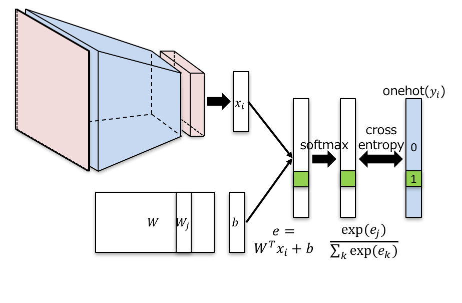
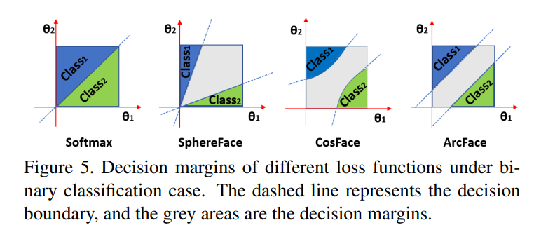

## 深層学習(CNN)と深層距離学習(ArcFace.MagFace)

ArcFace
 <https://arxiv.org/abs/1801.07698>
 
MagFace
 <https://arxiv.org/abs/2103.06627>


# Features
リアルタイムで通過した人物がだれかを識別することができる個人認証システムの
画像分類のシステム

深層距離学習を導入することで未知のデータを検出します

### 深層距離学習
CNNを特徴量抽出器として使用し出力結果に対して類似度を計算することで
未知データにも対応することを目的としています



深層距離学習とは、一般的なCNNに新たな損失関数を導入することで実装

この損失関数は同一クラスは距離が小さくなるように
  　　　　　　異なるクラスは距離が大きくなるように学習する手法



上記のように、決定境界にマージンをかけた上で
予測時に類似度を計算、閾値を設定し未知データを識別します

画像数が非常に少ないため、転移学習を導入
特徴量抽出器として
* VGG16
* MobileNet v2
* Resnet 50
* Inception v3

分類器として
* SVM
* MLP

を採用しています

これはImage netとは大幅に異なる画像を対象に分類するためです

参考:スタンフォード大学講義資料
<https://cs231n.github.io/transfer-learning/>

実装はGoogle colab上で実装


6分割交差検証を行います
main関数内のparse_args内のリスト内で各種パラメーターを一括管理しています

# Requirement
* tensorflow 3.x
* Keras


# Installation
```bash
None
```
 # Author
 
* Kazuki Mori
* Graduate School Student,Tokyo,Japan
